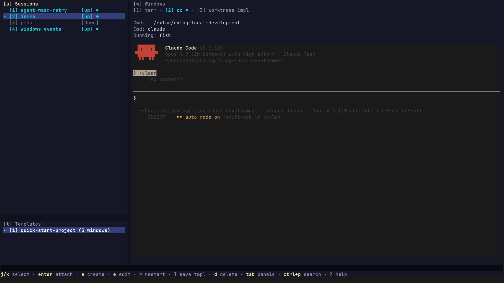

# ide

A terminal UI for managing **tmux**-based development environments.

`ide` is a launcher and dashboard for the projects you work on every day. Define each project once — its root directory,
the windows you want open, the commands they run — and `ide` handles spinning up the right `tmux` session, attaching to
it, and showing you what's running across every project at a glance.

> **Note:** `ide` is a frontend for `tmux`, not a replacement. `tmux` 3.2+ must be installed and on your `PATH` —
> without it, `ide` will not run.



---

## Features

- **One keystroke to attach** — pick a project, hit `enter`, you're in `tmux`.
- **Reproducible window layouts** — each environment lists its windows (`editor`, `logs`, `server`, …), each with its
  own startup command and working directory. Re-create the layout any time with `r r`.
- **Live status across all projects** — see at a glance which sessions are running, what command is in the foreground of
  each window, and whether an AI agent (Claude Code, etc.) is busy or idle in any pane.
- **Templates** — save a window layout once and reuse it when creating new environments (`go-service`, `next-app`, …).
- **Fuzzy search** — `Ctrl+P` opens a search across every window in every environment; `enter` jumps you straight there.
- **Embedded preview** — the right pane shows a live capture of the selected window without leaving `ide`.
- **In-tmux popup** — once attached, `prefix + a` opens the same fuzzy search inside `tmux` via `display-popup`.
- **19 built-in themes**, switchable with `Ctrl+T`.

---

## Requirements

- **`tmux`** — version 3.2 or newer (needed for `display-popup`). This is a hard requirement; `ide` shells out to `tmux`
  for everything.
- **Go 1.24+** (only for building from source).

---

## Platform support

| Platform                                        | Status                                                                                  |
| ----------------------------------------------- | --------------------------------------------------------------------------------------- |
| Linux (Arch)                                    | Tested                                                                                  |
| macOS                                           | Tested                                                                                  |
| Other Linux distros (Debian, Ubuntu, Fedora, …) | Likely works, untested                                                                  |
| Windows                                         | Not supported — `tmux` does not run natively on Windows; WSL2 may work but is untested. |

---

## Install

### From source

```bash
git clone https://github.com/<your-user>/ide.git
cd ide
go build -o ide .
mv ide ~/.local/bin/   # or anywhere on your PATH
```

`make build` produces the same binary at `./build/ide`.

### Verifying tmux

```bash
tmux -V    # should print 3.2 or higher
```

---

## Quick start

1. Run `ide` in your terminal. On first launch it creates an empty config at `~/.config/ide/environments.json` (or
   `$XDG_CONFIG_HOME/ide/environments.json`) and seeds it with a few built-in templates.
2. Press **`a`** to create your first environment. Give it a name, point it at a project root, and pick a template (or
   skip the template to start with a single shell window).
3. Press **`enter`** on the new environment to attach. `ide` creates the `tmux` session, opens the windows you defined,
   and drops you in.
4. Detach the way you always do (`Ctrl-b d` by default) — your session keeps running. Re-launch `ide` and you'll see it
   in the **Sessions** pane with an **`[↑]`** marker.

---

## Configuration

The config file is plain JSON. You can edit it directly or use the UI.

**Path** (follows `os.UserConfigDir`):

| Platform | Location                                            |
| -------- | --------------------------------------------------- |
| Linux    | `$XDG_CONFIG_HOME/ide/environments.json` (defaults to `~/.config/ide/environments.json`) |
| macOS    | `~/Library/Application Support/ide/environments.json` |
| Windows  | `%AppData%\ide\environments.json`                   |

## Keyboard reference

Press **`?`** at any time for the in-app shortcuts overlay. Highlights:

### Global

| Keys            | Action                               |
| --------------- | ------------------------------------ |
| `1` / `2` / `3` | Focus Sessions / Windows / Templates |
| `Tab`           | Cycle panels                         |
| `Ctrl+P`        | Fuzzy search across all windows      |
| `Ctrl+T`        | Theme picker                         |
| `n` / `N`       | Jump to next / previous AI window    |
| `r`             | Refresh sessions                     |
| `?`             | Toggle shortcuts overlay             |
| `q` / `Ctrl+C`  | Quit                                 |

### Sessions pane

| Keys      | Action                                   |
| --------- | ---------------------------------------- |
| `j` / `k` | Move selection                           |
| `Enter`   | Attach to session (creates it if needed) |
| `a`       | Create environment                       |
| `e`       | Edit selected environment                |
| `r r`     | Restart session (kill + recreate)        |
| `T`       | Save current windows as a template       |
| `d d`     | Delete environment (config only)         |
| `x x`     | Kill `tmux` session                      |

### Windows pane

| Keys      | Action                                  |
| --------- | --------------------------------------- |
| `h` / `l` | Move selection                          |
| `Enter`   | Open the window in an embedded terminal |
| `H` / `L` | Reorder windows                         |
| `Ctrl+Q`  | Exit embedded terminal                  |

### Templates pane

| Keys          | Action          |
| ------------- | --------------- |
| `j` / `k`     | Move selection  |
| `a`           | New template    |
| `e` / `Enter` | Edit template   |
| `d d`         | Delete template |

### Inside `tmux`

After `ide` creates a session it binds `prefix + a` to a popup that opens the same fuzzy search inside the running
`tmux` — no need to detach to switch projects.

---

## Development

See [`docs/development.md`](./docs/development.md).

---

## License

Licensed under the [Apache License, Version 2.0](./LICENSE). Copyright 2026 Vladimir Filipovic, Ivan Milutinovic.
