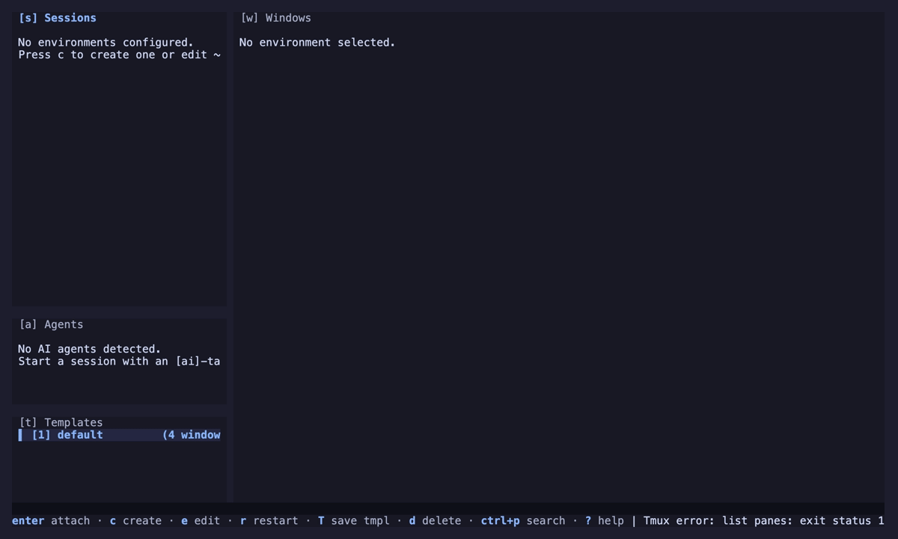
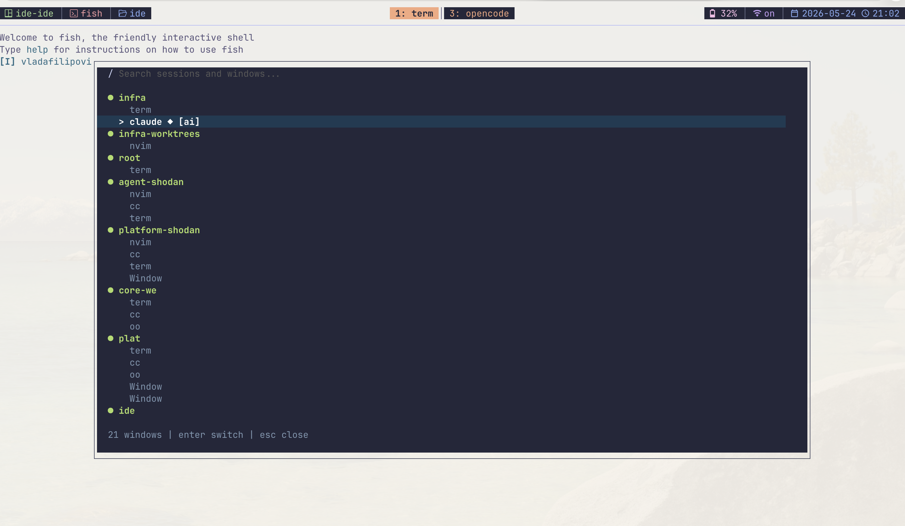

# ide

A terminal UI for managing **tmux**-based development environments.



The gif above (`docs/demo.gif`) is generated from `docs/demo.tape` with [VHS](https://github.com/charmbracelet/vhs):

```bash
brew install vhs   # one-time
make build
vhs docs/demo.tape # writes docs/demo.gif
```

The tape runs inside a throwaway `$HOME` and `$TMUX_TMPDIR`, so your real ide config and tmux server stay untouched.

## Automated project setup

You define an session once — a root directory and a list of windows, each with its own command and working directory —
and from then on, hitting `enter` brings the whole layout up. Anything that runs in a shell can be a window: editors,
dev servers, build watchers, log tails, REPLs, agents, docker compose, port-forwards, you name it.

## AI agent support

`ide` is built for the workflow where you have an AI coding agent running alongside your editor and server. Status
(`cooking` / `awaiting input` / `idle`) is shown next to each AI window, and `n` / `N` cycles between them so you can
hop to whichever agent finished first.

**Two ways a window gets tracked as AI:**

- **Tag it with `[ai]`** in the window name (e.g. `agent [ai]`). Use this when you launch the agent yourself, or when
  the CLI you use isn't auto-detected.
- **Automatic detection** when one of these CLIs is the foreground process: `claude`, `codex`, `aider`, `cursor-agent`,
  `gemini`, `opencode`. No tag needed — start the agent and `ide` picks it up.

---

## Requirements

- **`tmux`** — version 3.2 or newer (needed for `display-popup`). This is a hard requirement; `ide` shells out to `tmux`
  for everything.
- **Go 1.24+** (only for building from source).

## Install

### From source

```bash
git clone https://github.com/<your-user>/ide.git
cd ide
make build
mv ./build/ide ~/.local/bin/   # or anywhere on your PATH
```

## Quick start

1. Run `ide` in your terminal. On first launch it creates an empty config at `~/.config/ide/environments.json` (or
   `$XDG_CONFIG_HOME/ide/environments.json`) and seeds it with a few built-in templates.
2. Press **`c`** to create your first environment. Give it a name, point it at a project root, and pick a template (or
   skip the template to start with a single shell window).
3. Press **`enter`** on the new environment to attach. `ide` creates the `tmux` session, opens the windows you defined,
   and drops you in.
4. Detach the way you always do (`tmux leader +  d` by default) — your session keeps running. Re-launch `ide` and you'll
   see it in the **Sessions** pane with an **`[↑]`** marker.

Press **`?`** at any time for the in-app shortcuts overlay.

---

## Attaching to a specific window

Pressing **`enter`** on an environment attaches you to the session. To jump straight into a single window without
leaving `ide`, select it in the right pane and press **`shift+enter`** — `ide` opens the window's PTY inline so you can
type into it without spawning a new `tmux` client. Exit the embedded terminal to return to the dashboard.

### Inside `tmux`

After `ide` creates a session it binds `prefix + a` to a popup that opens the same fuzzy search inside the running
`tmux` — no need to detach to switch projects.



---

## CLI & AI agents

Everything the TUI does to your config is also exposed as a non-interactive CLI, so an AI coding agent (Claude Code,
Codex, etc.) can manage your sessions on your behalf — add a worktree, swap a window's command, drop in an `agent [ai]`
window — without driving the TUI.

```bash
ide --help                          # full command list
ide env list                        # what's configured
ide env add my-service --root ~/code/svc --template go-service
ide env window add my-service agent --cmd claude
ide template window set go-service editor --cmd "nvim ."
```

All commands read and write `~/.config/ide/environments.json`; the user still attaches in the TUI (or runs `r r` to
rebuild a live session) once the layout is in place.

**Example skill for AI agents:** [`docs/skills/manage-ide-sessions.md`](./docs/skills/manage-ide-sessions.md) — drop it
into Claude Code's skills directory so the agent knows when and how to use these commands.

---

## Configuration

The config file is plain JSON. You can edit it directly or use the UI.

**Path** (follows `os.UserConfigDir`):

| Platform | Location                                                                                 |
| -------- | ---------------------------------------------------------------------------------------- |
| Linux    | `$XDG_CONFIG_HOME/ide/environments.json` (defaults to `~/.config/ide/environments.json`) |
| macOS    | `~/Library/Application Support/ide/environments.json`                                    |
| Windows  | `%AppData%\ide\environments.json`                                                        |

---

## Platform support

| Platform                                        | Status                                                                                  |
| ----------------------------------------------- | --------------------------------------------------------------------------------------- |
| Linux (Arch)                                    | Tested                                                                                  |
| macOS                                           | Tested                                                                                  |
| Other Linux distros (Debian, Ubuntu, Fedora, …) | Likely works, untested                                                                  |
| Windows                                         | Not supported — `tmux` does not run natively on Windows; WSL2 may work but is untested. |

---

## Development

See [`docs/development.md`](./docs/development.md).

---

## License

Licensed under the [Apache License, Version 2.0](./LICENSE). Copyright 2026 Vladimir Filipovic, Ivan Milutinovic.
