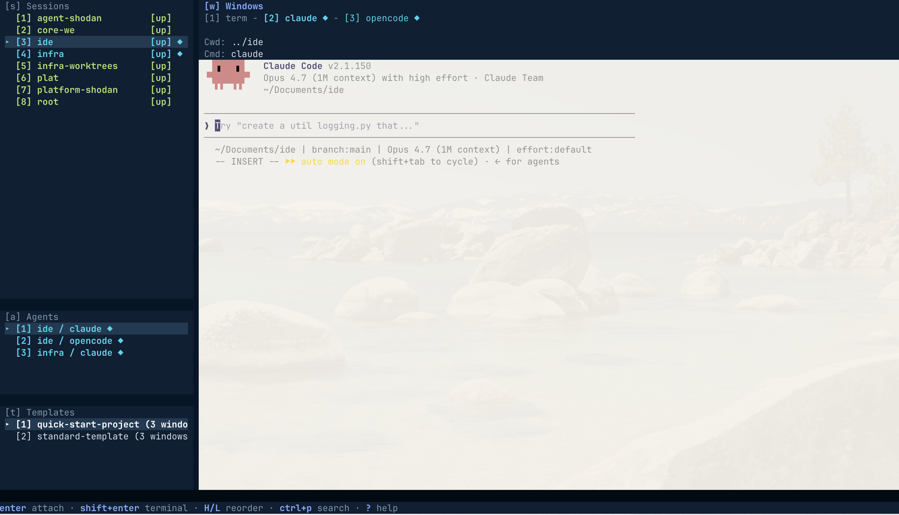

# ide

A terminal UI for managing **tmux**-based development environments.

`ide` is a launcher and dashboard for the projects you work on every day. Define each project once — its root directory,
the windows you want open, the commands they run — and `ide` handles spinning up the right `tmux` session, attaching to
it, and showing you what's running across every project at a glance.




---

## Features

- **One keystroke and you're in** — pick a project, hit `enter`, you're working. No setup, no rehydrating context.
- **Perfect for git worktrees** — spin up a dedicated environment per worktree (one for `main`, one for the feature
  branch, one for the hotfix) and jump between them instantly. Each gets its own editor, server, logs — no more
  `cd`-ing around or losing your place.
- **Reproducible window layouts** — each environment lists its windows (`editor`, `logs`, `server`, …), each with its
  own startup command and working directory. Re-create the layout any time with `r r`.
- **Live status across all projects** — see at a glance which sessions are running, what command is in the foreground
  of each window, and whether an AI agent (Claude Code, etc.) is busy or idle in any pane.
- **Templates** — save a window layout once and reuse it when creating new environments (`go-service`, `next-app`, …).
- **Fuzzy search** — `Ctrl+P` opens a search across every window in every environment; `enter` jumps you straight there.
  Once attached, `prefix + a` opens the same search from inside the session.
- **Embedded preview** — the right pane shows a live capture of the selected window without leaving `ide`.

  
- **19 built-in themes**, switchable with `Ctrl+T`.

---

## Automated project setup

You define an environment once — a root directory and a list of windows, each with its own command and
working directory — and from then on, hitting `enter` brings the whole layout up. Anything that runs in
a shell can be a window: editors, dev servers, build watchers, log tails, REPLs, agents, docker compose,
port-forwards, you name it.


## AI agent support

`ide` is built for the workflow where you have an AI coding agent running alongside your editor and server.
Status (`cooking` / `awaiting input` / `idle`) is shown next to each AI window, and `n` / `N` cycles
between them so you can hop to whichever agent finished first.

**Two ways a window gets tracked as AI:**

- **Tag it with `[ai]`** in the window name (e.g. `agent [ai]`). Use this when you launch the agent
  yourself, or when the CLI you use isn't auto-detected.
- **Automatic detection** when one of these CLIs is the foreground process: `claude`, `codex`, `aider`,
  `cursor-agent`, `gemini`, `opencode`. No tag needed — start the agent and `ide` picks it up.

---

## Requirements

- **`tmux`** — version 3.2 or newer (needed for `display-popup`). This is a hard requirement; `ide` shells out to `tmux`
  for everything.
- **Go 1.24+** (only for building from source).

---

## Platform support

| Platform                                        | Status                                                                                  |
| ----------------------------------------------- | --------------------------------------------------------------------------------------- |
| Linux (Arch)                                    | Tested                                                                                  |
| macOS                                           | Tested                                                                                  |
| Other Linux distros (Debian, Ubuntu, Fedora, …) | Likely works, untested                                                                  |
| Windows                                         | Not supported — `tmux` does not run natively on Windows; WSL2 may work but is untested. |

---

## Install

### From source

```bash
git clone https://github.com/<your-user>/ide.git
cd ide
make build
mv ./build/ide ~/.local/bin/   # or anywhere on your PATH
```

### Verifying tmux

```bash
tmux -V    # should print 3.2 or higher
```

---

## Quick start

1. Run `ide` in your terminal. On first launch it creates an empty config at `~/.config/ide/environments.json` (or
   `$XDG_CONFIG_HOME/ide/environments.json`) and seeds it with a few built-in templates.
2. Press **`c`** to create your first environment. Give it a name, point it at a project root, and pick a template (or
   skip the template to start with a single shell window).
3. Press **`enter`** on the new environment to attach. `ide` creates the `tmux` session, opens the windows you defined,
   and drops you in.
4. Detach the way you always do (`tmux leader +  d` by default) — your session keeps running. Re-launch `ide` and you'll see it
   in the **Sessions** pane with an **`[↑]`** marker.

---

## Configuration

The config file is plain JSON. You can edit it directly or use the UI.

**Path** (follows `os.UserConfigDir`):

| Platform | Location                                            |
| -------- | --------------------------------------------------- |
| Linux    | `$XDG_CONFIG_HOME/ide/environments.json` (defaults to `~/.config/ide/environments.json`) |
| macOS    | `~/Library/Application Support/ide/environments.json` |
| Windows  | `%AppData%\ide\environments.json`                   |

## Keyboard reference

Press **`?`** at any time for the in-app shortcuts overlay. Highlights:


---

## CLI & AI agents

Everything the TUI does to your config is also exposed as a non-interactive
CLI, so an AI coding agent (Claude Code, Codex, etc.) can manage your
sessions on your behalf — add a worktree, swap a window's command, drop in
an `agent [ai]` window — without driving the TUI.

```bash
ide --help                          # full command list
ide env list                        # what's configured
ide env add my-service --root ~/code/svc --template go-service
ide env window add my-service agent --cmd claude
ide template window set go-service editor --cmd "nvim ."
```

All commands read and write `~/.config/ide/environments.json`; the user
still attaches in the TUI (or runs `r r` to rebuild a live session) once
the layout is in place.

**Example skill for AI agents:** [`docs/skills/manage-ide-sessions.md`](./docs/skills/manage-ide-sessions.md)
— drop it into Claude Code's skills directory so the agent knows when and
how to use these commands.

---

## Development

See [`docs/development.md`](./docs/development.md).

---

## License

Licensed under the [Apache License, Version 2.0](./LICENSE). Copyright 2026 Vladimir Filipovic, Ivan Milutinovic.
